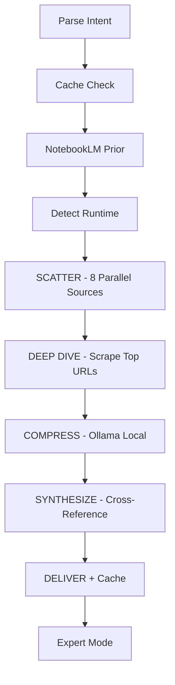

# Research Stack

**A Claude Code skill for deep, multi-source research**

[](LICENSE)
[](https://claude.ai/code)

Research Stack fires 8 parallel sources (Gemini CLI, Firecrawl, Perplexity, Reddit, Hacker News, Twitter, NotebookLM, WebSearch), compresses results locally via Ollama, and synthesizes everything into actionable findings with full source attribution. Built for context engineering — feed research directly into planning pipelines, vault notes, or follow-up conversations where Claude acts as a domain expert on your topic.

---

## Quick Start

**1. Clone the repo:**

```bash
git clone https://github.com/7alexhale5-rgb/research-stack.git
```

**2. Install the skill:**

```bash
cp -r research-stack ~/.claude/skills/research-stack
cp research-stack/commands/research-stack.md ~/.claude/commands/research-stack.md
```

**3. Use it in Claude Code:**

```
/research-stack Claude Code best practices
```

That's it. The skill auto-detects which tools you have installed and uses whatever is available.

---

## Architecture



| Step | What Happens |
|------|-------------|
| **Parse Intent** | Extracts topic, depth tier, query type, and flags from user input. |
| **Cache Check** | Queries memory-layer for recent research on the same topic (TTL: 24h fresh, 7d stale, then expired). |
| **NotebookLM Prior** | If a notebook is specified, checks for existing grounded knowledge before running the full pipeline. |
| **Detect Runtime** | Probes for available MCP servers and CLI tools, sets runtime flags, selects engines. |
| **SCATTER** | Fires all available sources in a single parallel burst — Gemini, Firecrawl, WebSearch, Reddit, HN, Twitter, NotebookLM. |
| **DEEP DIVE** | Scrapes 3-7 top URLs from search results (official docs, blog posts, GitHub READMEs prioritized). |
| **COMPRESS** | Pipes each scraped page through Ollama (qwen3:8b) for 60-80% token reduction before synthesis. |
| **SYNTHESIZE** | Cross-references all sources, weighted by reliability, extracting patterns, contradictions, and specifics. |
| **DELIVER + Cache** | Presents findings with a source stats dashboard, caches results for future sessions. |
| **Expert Mode** | Claude becomes a domain expert on the topic for the rest of the conversation. |

See [docs/architecture.md](docs/architecture.md) for a detailed walkthrough of each step.

---

## Tool Tiers

| Tier | Tools | Cost | What You Get |
|------|-------|------|-------------|
| **Minimum** (zero config) | WebSearch + WebFetch (built into Claude Code) | $0.00 | Basic multi-query research with scraping |
| **Recommended** (free) | + Gemini CLI + Ollama | $0.00 | AI research engine + 60-80% token compression |
| **Full** (free + optional paid) | + Firecrawl MCP + Perplexity MCP + HN MCP + NotebookLM + Obsidian | $0.00-10.00 | 8-source parallel pipeline with grounded RAG and persistent vault |

---

## Full Setup

The skill works out of the box with just Claude Code's built-in WebSearch and WebFetch. Each tool below adds capability but none are required.

<details>
<summary><strong>Gemini CLI</strong> (recommended, free)</summary>

The default AI research engine. Free tier: 20 requests/day (Flash), fewer for Pro.

```bash
npm install -g @google/gemini-cli
```

Set up authentication:

```bash
gemini # Follow the interactive auth flow on first run
```

Alternatively, create `~/.gemini/.env` with your API key:

```
GEMINI_API_KEY=your_key_here
```

The CLI auto-loads `~/.gemini/.env` — no environment variable export needed.

**Verify:** `gemini -m gemini-2.5-flash -p "Hello world"`

</details>

<details>
<summary><strong>Ollama</strong> (recommended, free)</summary>

Local LLM for compressing scraped content before synthesis. Saves 60-80% of input tokens.

```bash
brew install ollama
ollama serve  # Start the server (runs in background)
ollama pull qwen3:8b
```

**Verify:** `echo "Hello" | ollama run qwen3:8b "Summarize this"`

</details>

<details>
<summary><strong>Firecrawl MCP</strong> (optional, free tier available)</summary>

Search + scrape engine. Falls back to WebSearch + WebFetch if not configured.

Add to `~/.claude/settings.json`:

```json
{
  "mcpServers": {
    "firecrawl": {
      "command": "npx",
      "args": ["-y", "firecrawl-mcp"],
      "env": {
        "FIRECRAWL_API_KEY": "your_key_here"
      }
    }
  }
}
```

Get a free API key at [firecrawl.dev](https://firecrawl.dev).

**Note:** The `formats` parameter must be a JSON array `["markdown"]`, not a string.

</details>

<details>
<summary><strong>Perplexity MCP</strong> (optional, paid)</summary>

AI-powered research with citations. Only used when `--perplexity` flag is set.

Add to `~/.claude/settings.json`:

```json
{
  "mcpServers": {
    "perplexity": {
      "command": "npx",
      "args": ["-y", "@anthropic/perplexity-mcp"],
      "env": {
        "PERPLEXITY_API_KEY": "your_key_here"
      }
    }
  }
}
```

Cost: ~$0.02/query (sonar-pro), ~$5-10/query (sonar-deep-research with `--deep`).

</details>

<details>
<summary><strong>Hacker News MCP</strong> (optional, free)</summary>

Tech community discussion and sentiment.

Add to `~/.claude/settings.json`:

```json
{
  "mcpServers": {
    "hacker-news": {
      "command": "npx",
      "args": ["-y", "@anthropic/hacker-news-mcp"]
    }
  }
}
```

No API key needed.

</details>

<details>
<summary><strong>NotebookLM CLI</strong> (optional, free)</summary>

Grounded RAG from your curated notebooks. Queries NotebookLM for citation-backed answers.

```bash
pipx install notebooklm-py --python python3.12
notebooklm login
```

Requires Python 3.10+. The `pipx --python python3.12` flag ensures the right Python version.

**Verify:** `notebooklm list`

**Gotcha:** `notebooklm use` fails with `&` in notebook names. Use notebook IDs instead.

</details>

<details>
<summary><strong>Obsidian Vault</strong> (optional)</summary>

Persistent research vault with wikilinks, frontmatter, and Dataview integration.

The skill writes research notes and source notes to a vault directory when `--vault` is set. Obsidian is the recommended viewer but any markdown tool works.

See [Vault: Obsidian vs Alternatives](#vault-obsidian-vs-alternatives) below for options.

</details>

---

## Depth Tiers

| Depth | Sources | Scrapes | Compression | Est. Cost | Use When |
|-------|---------|---------|-------------|-----------|----------|
| `--shallow` | Gemini + WebSearch | 0 | No | ~$0.00 | Quick fact check |
| `--quick` | All available | 2-3 | Yes | ~$0.02 | Good-enough answer |
| default | All available | 3-5 | Yes | ~$0.05 | Standard research |
| `--deep` | All + extra queries | 5-7 | Yes | ~$0.10 | Comprehensive analysis |
| `--deep --perplexity` | All + deep research | 5-7 | Yes | ~$5-10 | Exhaustive, citation-heavy |

Default research costs about $0.05. The combination of Gemini (free tier) and Ollama (local compression) reduces costs by roughly 80% compared to sending raw scraped pages to Claude.

---

## Flags

| Flag | Description |
|------|------------|
| `--shallow` | Fastest path: Gemini + WebSearch only, no scraping |
| `--quick` | Fewer sources and scrapes, good for time-sensitive questions |
| `--deep` | Comprehensive: extra queries, more scrapes, extended Gemini research |
| `--perplexity` | Use Perplexity MCP instead of Gemini CLI as the AI research source |
| `--no-compress` | Skip Ollama compression, send raw scraped content to Claude |
| `--gemini-pro` | Use Gemini 2.5 Pro instead of Flash (higher quality, lower rate limits) |
| `--vault` | Write structured output to Obsidian research vault |
| `--notebook <name>` | Specify NotebookLM notebook for grounded RAG queries |
| `--content <type>` | Generate NotebookLM content (audio, slides, mind-map, infographic) |

Flags combine freely: `/research-stack --deep --vault --notebook "AI Agents" topic here`

---

## Vault: Obsidian vs Alternatives

| Option | Graph View | Wikilinks | Plugins | Setup |
|--------|-----------|-----------|---------|-------|
| Obsidian | Yes | Yes | Dataview, Templater | Recommended |
| Logseq | Yes | Yes | Limited | Good alternative |
| Foam (VS Code) | Yes | Yes | VS Code ecosystem | Dev-friendly |
| Plain Markdown | No | Manual | grep + Claude Code Grep | Zero setup |

The `--vault` flag writes standard markdown with YAML frontmatter and `[[wikilinks]]`. Any tool that reads markdown will work. Obsidian gives you graph view and Dataview queries out of the box.

See [docs/alternatives.md](docs/alternatives.md) for a full setup guide for each option.

---

## Configuration

Copy the example config and customize:

```bash
cp config/config.example.md config/config.md
```

Key settings:
- **Vault path**: Where research notes are written (default: `~/Projects/research-vault/`)
- **Notebook routing**: Keyword-to-notebook mapping for auto-routing (see `references/notebook-routing.md`)
- **Compression model**: Ollama model for compression (default: `qwen3:8b`)
- **Cache TTL**: How long cached research stays fresh (default: 24h fresh, 7d stale)

---

## FAQ / Troubleshooting

**"Gemini CLI says quota exhausted"**
Free tier has 20 requests/day for Flash, fewer for Pro. Resets daily. The skill automatically falls back to extra WebSearch queries when this happens. If Gemini produces partial output before hitting the quota, the skill uses the partial results.

**"NotebookLM auth expired"**
Run `notebooklm login` to re-authenticate. The CLI will open a browser for Google OAuth.

**"Firecrawl formats error"**
The `formats` parameter must be a JSON array `["markdown"]`, not a string `"markdown"`. This is a common MCP configuration issue.

**"Background task ID not found"**
Known issue with Claude Code background tasks across tool calls. The skill runs Gemini directly (not in background) for `--deep` depth to avoid this. For other depths, Gemini runs in background as a supplement — if it doesn't return in time, the skill proceeds without it.

**"Ollama is slow / hangs"**
First run downloads the model (~5GB for qwen3:8b). Subsequent runs are fast. If Ollama hangs during compression, the skill falls back to raw content after a 60-second timeout. Make sure `ollama serve` is running.

**"No MCP tools detected"**
The skill works without any MCP servers — it falls back to WebSearch + WebFetch (built into Claude Code). Check `~/.claude/settings.json` if you want to enable optional tools.

---

## Contributing

1. Fork the repo
2. Create a feature branch (`git checkout -b feature/my-feature`)
3. Make changes and test with `/research-stack` in Claude Code
4. Submit a pull request

The skill is a single markdown file (`SKILL.md`) that Claude Code interprets at runtime. No build step, no dependencies beyond optional CLI tools.

---

## License

MIT License. See [LICENSE](LICENSE) for details.
