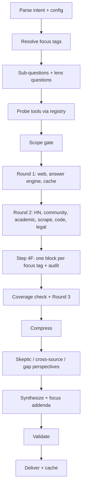

# Research Stack

**A Claude Code skill for deep, multi-source, targeted research**

[](LICENSE)
[](https://claude.ai/code)

Research Stack v3 turns a topic into 3 to 6 sharp sub-questions and searches for each one in
tiered parallel rounds. It fires only the sources that are up and relevant, checks coverage per
sub-question, challenges the findings with skeptic passes, and delivers a decision-first report
where every claim carries a source tag and a concrete specific.

**Focus lenses** make a run deliberately targeted. Add `--focus seo,security` (or `#seo #security`
anywhere in the prompt) and each lens switches on its own tool stack, adds the questions an
expert in that area would ask, ranks that area's primary authorities highest, and requires its
own section in the report. Add `--target https://your-site` and the lenses also measure your own
asset live.

It runs on free tools out of the box. Paid APIs and MCPs (DataForSEO, SpyFu, Mobbin, Foreplay,
Exa, Perplexity, Firecrawl and others) are used only when configured, never on `--free`, and
always within a per-run budget.

---

## Quick start

```bash
git clone https://github.com/7alexhale5-rgb/research-stack.git
./research-stack/install.sh
```

Then, in Claude Code:

```text
/research-stack which auth library for our Next.js app #build-pick
```

`install.sh` copies the skill, lenses, registry, scripts and config example into
`~/.claude/skills/research-stack/`, puts the command in `~/.claude/commands/`, and lints the
install. It is safe to re-run.

---

## How it works


```mermaid
flowchart TD
    A[Parse intent + config] --> B[Resolve focus tags]
    B --> C[Sub-questions + lens questions]
    C --> D[Probe tools via registry]
    D --> E[Scope gate]
    E --> F[Round 1: web, answer engine, cache]
    F --> G[Round 2: HN, community, academic, scrape, code, legal]
    G --> H[Step 4F: one block per focus tag + audit]
    H --> I[Coverage check + Round 3]
    I --> J[Compress]
    J --> K[Skeptic / cross-source / gap perspectives]
    K --> L[Synthesize + focus addenda]
    L --> M[Validate]
    M --> N[Deliver + cache]
```

The full step map is in [docs/architecture.md](docs/architecture.md).

On `--deep` and on runs with 4+ sub-questions, Rounds 1-3 run in **hunter/gatherer mode**:
one read-only hunter subagent per sub-question writes evidence cards; a fresh-context gatherer
scores each card against a rubric from the brief (a free Claude subagent; Jev in shadow mode),
keeps, drops or escalates it, and sends coverage gaps back for a re-hunt; the writer reads only
the kept cards. See [references/hunter-gatherer.md](references/hunter-gatherer.md).

---

## Focus tags

| Tag          | Tool stack (free fallbacks always available)                                  | Report section               |
| ------------ | ----------------------------------------------------------------------------- | ---------------------------- |
| `seo`        | DataForSEO, SpyFu, Semrush, Ahrefs, Search Console, PageSpeed, CrUX, schema checks, HubSpot AEO, Firecrawl | SEO scorecard |
| `content`    | Foreplay, Meta Ad Library, SpyFu ad history, DataForSEO, HubSpot, Higgsfield, YouTube | Content and creative angles |
| `market`     | NinjaPear, Crunchbase, Exa, Parallel, Product Hunt, G2, Foreplay, SpyFu, HubSpot, VIKTOR | Vendor and competitor matrix |
| `ui-ux`      | Mobbin, Refero, Foreplay, Figma, shadcn, Playwright, NN/g, Baymard, Awwwards  | Pattern references           |
| `a11y`       | W3C WAI, axe-core, Lighthouse, Playwright                                     | Accessibility checklist      |
| `perf`       | CrUX, PageSpeed, Lighthouse, Chrome DevTools, Bundlephobia, HTTP Archive      | Performance budget           |
| `security`   | OSV, GitHub Advisories, CISA KEV, NVD, Socket, Snyk, Semgrep, secret scanning, OWASP 2025 / LLM / Agentic | Threat and advisory table |
| `devtools`   | Context7, DeepWiki, grep.app, GitHub, deps.dev, npm stats, Bundlephobia, Socket, HN | Library decision matrix |
| `ai-agents`  | Claude docs, arXiv, Semantic Scholar, paper search, Artificial Analysis, promptfoo | Model and eval evidence |
| `data-infra` | Vendor docs, Jepsen, DB-Engines, status pages, gcloud                         | Data and infra trade-offs    |
| `comms`      | RingCentral, Twilio, Telnyx, Aircall, Dialpad, CallRail, FCC/eCFR/CTIA rules  | Telephony and messaging plan |
| `legal`      | Legal Data Hunter, official statutes, regulators                              | Legal authority table        |

**Bundles:** `#launch` (seo, perf, a11y, content), `#ship-audit` (security, perf, a11y),
`#competitive` (market, seo, content), `#build-pick` (devtools, security).

**Rules:**
- At most 4 tags per run.
- With no tag, the scope gate *suggests* matching tags (`python3 scripts/focus_check.py suggest
  "<topic>"` shows the same matches) but never applies them silently.
- A lens whose paid tools are missing still runs on its free path and says what it could not
  measure.

Each lens is a plain markdown contract in [focus/](focus/). See
[focus/CONTEXT.md](focus/CONTEXT.md) to add or change one.

### Audit mode

`--target <url|repo|path>` runs each active lens's live checks against your own asset:
- **SEO:** PageSpeed, CrUX, schema, robots and sitemap.
- **a11y:** axe and a keyboard walk.
- **security:** OSV on the lockfiles, Semgrep, secret scan.
- **devtools:** dependency health.

Audits are read-only. They never write to, log in to, or submit anything on the target, and a
found secret is reported by file and line, never by value.

---

## Tools

[docs/tools-reference.md](docs/tools-reference.md) lists all 94 tools and connectors in the
registry: what each is best at, its cost class, source tag and free fallback. The registry
itself is [references/tool-registry.json](references/tool-registry.json).

| Tier          | What you get                                                                                         |
| ------------- | ---------------------------------------------------------------------------------------------------- |
| **Free**      | Web search and page fetch (built in), Hacker News, arXiv and Crossref, OSV, CISA KEV, deps.dev, PageSpeed, Playwright, axe-core, DeepWiki, grep.app. Every lens works. |
| **Paid**      | Answer engine (Perplexity), index search (Exa, Parallel, Tavily, Brave, Kagi), scraper (Firecrawl), and domain APIs (DataForSEO, SpyFu, Semrush, Ahrefs, Foreplay, Mobbin, Refero, Crunchbase, NinjaPear). |
| **Connectors**| Team sources through MCP: HubSpot, Slack, Atlassian, Fireflies, Microsoft 365, Superhuman, Wispr Flow, VIKTOR. |
| **Power tier**| Gemini CLI, Groq compression, NotebookLM, last30days, an Obsidian-style vault ([references/power-tier.md](references/power-tier.md)). |

Check what is configured, without printing any key:

```bash
python3 ~/.claude/skills/research-stack/scripts/focus_check.py probe seo security
```

---

## Flags

| Flag                   | Effect                                                                                |
| ---------------------- | ------------------------------------------------------------------------------------- |
| `--focus <tags>`, `#tag` | Focus lenses and bundles.                                                           |
| `--target <x>`         | Read-only live audit by the active lenses.                                             |
| `--deep`               | More pages, synthesis assist, all perspectives, YouTube, automatic validation.         |
| `--free`               | Never call a paid provider.                                                            |
| `--no-ask`             | No clarifying question; the scope gate becomes a notice.                               |
| `--hunt` / `--no-hunt` | Force hunter/gatherer mode (on by default for `--deep` and 4+ sub-questions).          |
| `--validate`           | Run the validation gate.                                                               |
| `--auto-refine`        | Loop until findings are stable (max 3).                                                |
| `--youtube`            | Read talk and tutorial transcripts.                                                    |
| `--notes`              | One note per source next to the cache file.                                            |
| `--vault`, `--notebook <name>`, `--content <type>`, `--gemini-pro`, `--groq-model <m>` | Power tier. |

A simple factual question runs auto-shallow with no flag. Flags combine freely:

```text
/research-stack launch readiness for our pricing page #launch --target https://example.com/pricing --deep
```

---

## Output

```text
---
date: 2026-10-01
type: research
topic: "auth library for a Next.js checkout"
depth: default
focus: [security, devtools]
target: none
---
## Research: auth library for a Next.js checkout
### Decision answer
### Sub-question answers   (Q1 [devtools] ..., Q2 [security] ...)
### Contradictions
### Patterns
### Coverage gaps
### Threat and advisory table
### Library decision matrix
--- source-stats dashboard (per-source counts, focus tools used / missing, cost)
```

Every finding carries tags such as `[OSV + GHSA]`, `[C7 + DEPS]`, `[DFS]`, `[HN:120]` or
`[AUDIT:psi]`. Validate any report:

```bash
python3 ~/.claude/skills/research-stack/scripts/validate_report.py all report.md
```

The validator checks structure, focus addenda, citation liveness and source quality, and it
never writes to the report. A compact cache copy is always written (`CACHE_DIR`, default
`~/Projects/research-vault/research/`) so the next run on the same topic can reuse it.

---

## Configuration

Copy `config/config.example.md` to `~/.claude/skills/research-stack/config/config.md`. Every key
in it is one the skill reads:
- `CACHE_DIR`
- `VAULT_PATH`
- `DEFAULT_FOCUS`
- the `BUDGET_*` caps
- `DISABLED_TOOLS`
- the power-tier model ids

Keys come from the environment only.

---

## With the development protocol

[development-protocol](https://github.com/7alexhale5-rgb/development-protocol) bundles a port of
this skill as the `research` checklist row. Its checklist suggests focus tags from the goal text.
[pathway-operating-layer](https://github.com/7alexhale5-rgb/pathway-operating-layer) derives tags
from a work item's risk overlays (for example `supply-chain` gives `--focus security,devtools`),
and its research verifier requires each declared tag's report section.

---

## Contributing

There is no build step. Python 3.9+ standard library only.

```bash
python3 -m unittest discover tests
python3 scripts/focus_check.py lint
python3 scripts/focus_check.py docs
```

New tools go in the registry first, then in a lens; the linter enforces that both agree and that
every paid tool has a free fallback. Dated tool facts belong in a new dossier under
`docs/research/`.

## License

MIT. See [LICENSE](LICENSE).
