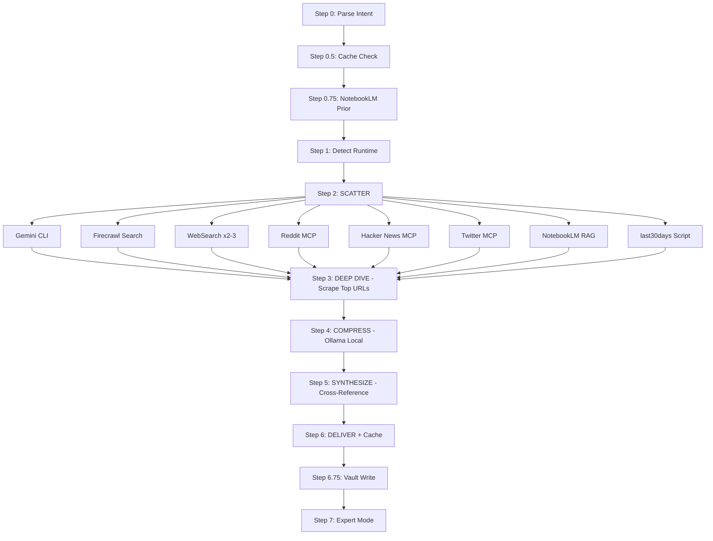

# Architecture

Detailed walkthrough of the Research Stack pipeline, from input to expert mode.

---

## Pipeline Overview



---

## Step-by-Step Walkthrough

### Step 0: Parse Intent

Extracts structured parameters from the user's natural language input. The topic is everything except flags. Depth defaults to standard unless `--shallow`, `--quick`, or `--deep` is specified. The query type (recommendations, news, how-to, general) determines which WebSearch queries are generated later.

Output: `TOPIC`, `DEPTH`, `QUERY_TYPE`, and a set of boolean flags (`--perplexity`, `--vault`, `--notebook`, etc.).

### Step 0.25: Cost Confirmation

Only triggers for `--deep --perplexity` (sonar-deep-research at $5-10/query). The user must confirm before the pipeline proceeds. `--deep` without `--perplexity` uses Gemini (free) and skips this gate.

Output: Confirmation to proceed or downgrade to default depth.

### Step 0.5: Cache Check

Queries the `research-cache` collection in memory-layer for recent research on the same topic. Results less than 24 hours old are served directly. Results 1-7 days old are shown with an option to refresh. Results older than 7 days are treated as expired and trigger a fresh run.

Output: Cache hit (skip to Expert Mode) or cache miss (continue pipeline).

### Step 0.75: NotebookLM Prior Knowledge

Only runs when `--notebook` is set and NotebookLM is available. Asks the specified notebook what it already knows about the topic. This grounded, citation-backed answer supplements (but does not replace) the full pipeline. If NotebookLM is unavailable or times out, the step is silently skipped.

Output: `NOTEBOOKLM_PRIOR` text with citations, or empty.

### Step 1: Detect Runtime and Available Tools

Probes for every tool the pipeline can use: MCP servers (Firecrawl, Perplexity, Reddit, HN, Twitter) and CLI tools (Gemini, Ollama, NotebookLM). Sets boolean flags for each. Then selects the research engine (Perplexity if flagged, Gemini if available, extra WebSearch as fallback), scrape engine (Firecrawl or WebFetch), and compression engine (Ollama or raw passthrough).

Output: Runtime flags and engine selections.

### Step 1.5: Shallow Path

Only for `--shallow` depth. Runs a single Gemini query and 1-2 WebSearch queries, synthesizes immediately, caches, and delivers. Skips scraping, compression, and all optional sources. Cost: ~$0.00.

Output: Abbreviated findings, then jumps to Expert Mode.

### Step 2: SCATTER (Parallel Source Firing)

The core of the pipeline. All available sources fire in a single parallel burst:

1. **Gemini CLI / Perplexity** -- AI research with citations. Gemini runs in background for default/quick, foreground for `--deep`.
2. **Firecrawl Search** -- Returns 5-15 URLs with snippets. Falls back to WebSearch if unavailable.
3. **WebSearch** -- 2-3 queries tailored by query type (recommendations, news, how-to, general). `--deep` adds a third query.
4. **Reddit MCP** -- Hot posts from 1-3 relevant subreddits. Comments fetched for high-scoring posts.
5. **Hacker News MCP** -- Story search with point scores.
6. **Twitter MCP** -- Tweet search for real-time pulse. Skipped silently on auth errors.
7. **NotebookLM RAG** -- Grounded queries against the specified notebook. `--deep` adds follow-up queries for contradictions and quantitative data.
8. **last30days Script** -- Background script for Reddit/Twitter data via an alternative path.

Output: Raw results from all sources that responded.

### Step 3: DEEP DIVE (Scraping)

Identifies the top 3-7 URLs from search results and scrapes them for full content. Priority order: official docs, detailed blog posts, GitHub READMEs, news articles, forum threads. Uses Firecrawl if available, WebFetch as fallback. Also collects background task outputs (Gemini CLI, last30days script) and compensates for any sources that failed by adding extra WebSearch queries.

Output: Full page content for top URLs, collected background task results.

### Step 4: COMPRESS (Local Token Reduction)

Each scraped page is piped through Ollama (qwen3:8b) to extract only key facts, data points, names, versions, dates, and actionable insights. Content is written to temp files first (never heredocs — scraped text breaks shell escaping), then piped to Ollama with ANSI/spinner stripping. Reduces ~5,000-20,000 tokens per page down to ~500-1,000 tokens. All compression calls run in parallel.

Output: Compressed bullet-point summaries for each scraped page. Falls back to raw content on timeout or error.

### Step 5: SYNTHESIZE (Cross-Reference)

Weighs all sources by reliability (NotebookLM and Reddit highest, WebSearch snippets lowest) and produces a synthesis. Identifies patterns appearing in 2+ sources, flags contradictions, extracts specific names/versions/dates/numbers, and generates actionable insights. Everything is grounded in what the sources actually say, not pre-existing model knowledge.

Output: Structured findings with source attribution.

### Step 6: DELIVER + Cache

Presents findings in a structured format: Key Findings (3-5 bullets), Patterns Across Sources, and Notable Details. Appends a Source Stats Dashboard showing which sources were used, how many results each returned, compression stats, estimated cost, and scraped domains. Caches a compact summary to `research-cache` in memory-layer for future sessions.

Output: Final research report delivered to the user.

### Step 6.75: Vault Write

Only runs when `--vault` is set and the vault directory exists. Creates a research note with YAML frontmatter, executive summary, findings with `[[wikilinks]]` to source notes, and a source attribution table. Creates individual source notes for each scraped URL. Updates existing MOCs if a matching one is found. Optionally ingests URLs into NotebookLM and generates content (audio, slides, mind-map, infographic).

Output: Markdown files written to the research vault.

### Step 7: Expert Mode

After delivery, Claude becomes a domain expert on the researched topic for the rest of the conversation. Follow-up questions are answered from gathered data without new searches. New research only triggers if the user asks about a clearly different topic.

---

## Graceful Degradation

The pipeline is designed to work even when most tools are missing. Every source has a fallback.

| Missing Tool | What Happens | Fallback |
|-------------|-------------|----------|
| Gemini CLI (not installed) | AI research source skipped | 2-3 extra WebSearch queries |
| Gemini CLI (quota exhausted) | Partial output before 429 error | Use partial output + 1-2 extra WebSearch queries |
| Ollama | Compression step skipped | Raw scraped content passed to Claude |
| Firecrawl MCP | Search + scrape unavailable | WebSearch for URLs, WebFetch for scraping |
| Perplexity MCP | Only matters if `--perplexity` flag set | Gemini CLI (default engine) |
| Reddit MCP | Community data unavailable | last30days script for Reddit data |
| last30days script | Script not found | Reddit MCP for community data |
| Hacker News MCP | HN data unavailable | Skipped, noted in report |
| Twitter MCP | Twitter data unavailable | Skipped, noted in report |
| NotebookLM CLI | Grounded RAG unavailable | Skipped, noted in report |
| Obsidian vault | Vault directory missing | Vault write skipped, warning shown |
| WebSearch | Built-in tool error | Firecrawl search results only |

### Minimum Viable Configurations

- **With Gemini + Ollama**: Full AI research + compression. Cost: $0.00.
- **Built-in only**: WebSearch + WebFetch. No installs needed. Covers basic research.
- **Complete failure**: If all sources fail, the skill reports what happened and suggests checking tool installations.

---

## Data Flow

```
INPUT
  Topic string + flags (depth, perplexity, vault, notebook, etc.)
      |
      v
INTERMEDIATE ARTIFACTS
  - Search results (URLs + snippets from Firecrawl or WebSearch)
  - Gemini CLI output (research text with citations)
  - Scraped page content (full markdown from top URLs)
  - Compressed summaries (Ollama bullet points, ~80% smaller)
  - Reddit posts + comments (with scores)
  - HN stories + points
  - Tweet data (if available)
  - NotebookLM grounded answers (with citations)
  - Cache lookup results (if any)
      |
      v
OUTPUT
  - Structured findings (Key Findings, Patterns, Notable Details)
  - Source Stats Dashboard (tool availability, counts, cost)
  - Cache entry (compact summary stored for future sessions)
  - Vault notes (if --vault): research note + source notes + MOC updates
  - NotebookLM ingestion (if --notebook): URLs added as sources
  - Expert Mode context (Claude retains all gathered data)
```

### Token Economics

| Stage | Tokens per Page | Notes |
|-------|----------------|-------|
| Raw scraped content | 5,000-20,000 | Full page markdown |
| After Ollama compression | 500-1,000 | Key facts only |
| Savings | 60-80% | Fewer input tokens to Claude for synthesis |

For a typical default-depth run scraping 4 pages, compression saves roughly 15,000-60,000 input tokens.
